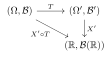

# Chap 5, Integration and Expectation

## Summary 

### Summary from 5.1 to 5.3
**(2026-01-30)**
I want to summarize the main idea from Sections 5.1 to 5.2.

#### Simple functions as the basic building blocks
We start from **simple functions** (finite range), i.e. functions of the form
\[
X=\sum_{i=1}^m a_i\,\mathbf{1}_{A_i},
\]
which are the “basic blocks” because they’re easy to compute with, and they’re measurable (so they are random variables too).

#### Theorem 5.1.1 (Measurability Theorem): approximation by simple functions
In **Theorem 5.1.1 (Measurability Theorem)** (for \(X(\omega)\ge 0\)), we prove that a random variable \(X\) is measurable **iff** it can be approximated from below by an **increasing** sequence of simple functions:
\[
0\le X_n \uparrow X.
\]

The construction idea is to **slice the range** of \(X\) into many small bins, and also **truncate** at level \(n\). Using a dyadic mesh \(2^{-n}\) (or more generally \(b^{-n}\)) is important because these partitions are **nested**, so the approximation can be made monotone increasing.

I tried to slice with step size \(1/n\), but that does **not** guarantee \(X_n\uparrow X\) since the partitions aren’t nested (so the “rounded-down” approximations can go down when \(n\) changes).

#### Defining expectation via extension from simple functions
Expectation is first defined for simple functions in the most elementary way:
\[
E(X)=\sum_{i=1}^m a_i\,P(A_i),
\]
which is exactly “sum of (possible value) \(\times\) (its probability).”

Then for a general measurable \(X\ge 0\), we **extend** the definition by approximation: pick simple \(X_n\uparrow X\) and set
\[
E(X):=\lim_{n\to\infty}E(X_n).
\]

A key point is that this limit is **well-defined** (it doesn’t depend on the particular approximating sequence), so expectation becomes a legitimate object for all nonnegative measurable random variables. This is a classic analysis strategy: define something on a handy class, then extend it to a larger class via limits.

#### Why monotone convergence is central
This viewpoint also explains why **monotone convergence** matters: if \(0\le X_n\uparrow X\), then
\[
E(X_n)\uparrow E(X),
\]
so under monotone increase we can exchange “take limits” and “take expectations.” Conceptually, the proof (and the entire construction) keeps returning to the base case of simple functions.

#### Markov’s inequality: probability via indicators and expectation
Finally, in **Markov’s inequality**, the indicator function is the bridge between probability and expectation: since
\[
\mathbf{1}_{\{X\ge a\}}\le \frac{X}{a}\quad (X\ge 0),
\]
we get
\[
P(X\ge a)=E\!\left(\mathbf{1}_{\{X\ge a\}}\right)\le \frac{E(X)}{a}.
\]

This is a clean example of how expectations control probabilities by rewriting events as indicator random variables.
 
Also here is a R code to illustrate the approximating process
```{r}
## Simple-function approximation:
## X_n = floor(2^n * X) / 2^n  on {X < n}, and = n on {X >= n}
Xn_simple <- function(X, n) {
  pmin(n, floor((2^n) * X) / (2^n))
}

## Grid for omega (pick 0..2 so truncation is visible for small n)
omega <- seq(0, 2, length.out = 4001)

## Two target functions
X_id <- omega          # X(ω) = ω
X_sq <- omega^2        # X(ω) = ω^2

## Choose which approximations to show
n_vec <- 1:9

## Compute approximations
approx_id <- sapply(n_vec, function(n) Xn_simple(X_id, n))
approx_sq <- sapply(n_vec, function(n) Xn_simple(X_sq, n))

## ---- Plot: X(ω)=ω ----
par(mfrow = c(1, 2), mar = c(4, 4, 3, 1))

plot(omega, X_id, type = "l", lwd = 2,
     xlab = expression(omega), ylab = expression(X(omega)),
     main = expression(X(omega) == omega))

for (i in seq_along(n_vec)) {
  lines(omega, approx_id[, i], type = "s", lty = i + 1, lwd = 2)
}

legend("topleft",
       legend = c("true", paste0("X_n, n=", n_vec)),
       lty = c(1, 2:(length(n_vec) + 1)), lwd = 2, bty = "n")

## ---- Plot: X(ω)=ω^2 ----
plot(omega, X_sq, type = "l", lwd = 2,
     xlab = expression(omega), ylab = expression(X(omega)),
     main = expression(X(omega) == omega^2))

for (i in seq_along(n_vec)) {
  lines(omega, approx_sq[, i], type = "s", lty = i + 1, lwd = 2)
}

legend("topleft",
       legend = c("true", paste0("X_n, n=", n_vec)),
       lty = c(1, 2:(length(n_vec) + 1)), lwd = 2, bty = "n")
```


#### From MCT to DCT (5.3)
**(2026-02-07)**
The bridge that connects MCT, which can be only applied to monotone sequence, and the DCT is the Fatou Lemma(s). The DCT is basically the squeezing of 2 Fatous.

When we proving the $\sup$ version of Fatou Lemma, I wondered that why do we need a $Z\in L_1$, such that $X_n\leq Z$? Can we just say that 
$$
\begin{aligned}
E(\limsup_{n\to\infty} X_n)&=E\left\{\lim_{n\to\infty}(\sup_{k\geq n}X_k)\right\}\\
&=\lim_{n\to\infty}E(\sup_{k\geq n}X_k)\\
&\geq\lim_{n\to\infty}\sup_{k\geq n}E(X_k)\\
&=\limsup_{n\to\infty} E(X_n)
\end{aligned}
$$
what's wrong is that, we incorrectly used the decreasing version of MCT, that is, generally we don't have $E\left\{\lim_{n\to\infty}(\sup_{k\geq n}X_k)\right\}=\lim_{n\to\infty}E(\sup_{k\geq n}X_k)$, for example, we can let $X_n=n\mathbb{1}_{(0,\frac{1}{n})}$ on $(\Omega,\mathcal{B},P)=((0,1),\mathcal{B}((0,1)),\lambda)$, then $X_n\to 0$ a.s., and $E(X_n)=1$, so $\limsup_{n\to\infty} E(X_n)=1$ of course. However, if we focus on $\lim_{n\to\infty}E(\sup_{k\geq n}X_k)$, we should see that 
$$
S_n(\omega)=\sup_{k\geq n}X_k(\omega)=\left\lfloor\frac{1}{\omega}\right\rfloor\mathbb{1}_{(0,\frac{1}{n})}\, \text{a.s.}
$$
Then what is $E(\sup_{k\geq n}X_k)$? I think that is the interesting part
$$
\begin{aligned}
E(\sup_{k\geq n}X_k)&=\int_{(0,\frac{1}{n})}\left\lfloor\frac{1}{\omega}\right\rfloor dP\\
&=\sum_{m=n}^\infty\int_{\frac{1}{m+1}}^{\frac{1}{m}}mdP\\
&=\sum_{m=n}^\infty m(\frac{1}{m}-\frac{1}{m+1})\\
&=\sum_{m=n}^\infty\frac{1}{m+1}=\infty,
\end{aligned}
$$
and that is why we need a $Z\in L_1$ to dominate the sequence, more specifically, if we have $X_n\leq Z\in L_1$, then $E\left\{\lim_{n\to\infty}(\sup_{k\geq n}X_k)\right\}=\lim_{n\to\infty}E(\sup_{k\geq n}X_k)$.

So the path from 5.1 to 5.3 is: what is an integral for simple function $\to$ what is an integral for nonnegative measurable function $\to$ what is an integral for measurable function $\to$ how the sequence of integral converge.

### Summary from 5.4 to 5.6 
**(2026-02-12)**
Before 5.4, we mostly talk about integrals on the whole space ($\Omega$): expectation is ($\int_\Omega XdP$).

#### 5.4 Indefinite integrals

5.4 lets us integrate over an **arbitrary measurable set** ($A\in\mathcal B$). The definition fits intuition: just insert an indicator,
$$
\int_A X,dP := \int_\Omega X,\mathbf 1_A,dP.
$$
So unlike calculus—where “indefinite integral” usually means “find an antiderivative”—here “indefinite” means the set ($A$) is not fixed in advance. It turns the integral into a whole set-function ($A\mapsto \int_A XdP$), which in real analysis is often a stepping stone toward Radon–Nikodym, since it behaves like a (signed) measure.

#### 5.5 Transformation theorem

In this book, the point of introducing indefinite integrals is to set up the **transformation theorem**—which I mentally treat as the substitution rule for definite integrals, but now in probability language.

The key message is: once you identify the right “pushforward” measure (the distribution)
$$
F = P\circ X^{-1},
$$
you can **draw the integral back from the abstract ($\Omega$)** to something concrete. In the real-valued case, that means pulling everything back down to the solid ground of the real line:
$$
E[g(X)] = \int_{\Omega} g(X(\omega))dP(\omega)
= \int_{\mathbb R} g(x)F(dx),
$$
so instead of integrating on ($\Omega$), you integrate on $(\mathbb R,\mathcal B(\mathbb R))$ using the distribution. And when $F$ is absolutely continuous, this "distribution integral" further collapses into the most familiar picture from basic probability: a density $f$, so the expectation becomes an ordinary-looking integral against $f(x)dx$.

{width=40%}

#### 5.6 Lebesgue Meets Riemann 
**(2026-02-14)**
From 5.5 we know that, we can use transformation theorem to push the measure forward, that is, turn an integral on $(\Omega,\mathcal{B},P)$ into an integral on $(\mathbb{R},\mathcal{B}(\mathbb{R}),F_X)$, that is
$$
E[g(X)]=\int_\Omega g(X)dP=\int_{\mathbb{R}} g(x)dF_X,
$$
and if $F_X$ is absolutely continuous (AC), then there will be a density $f_X(x)$, and it becomes $\int_{\mathbb{R}} g(x)f_X(x)dx$, then in 5.6, we know how to compute this Lebesgue integral, that is, the Theorem 5.6.1 provides a bridge for proper Riemann integrals, and also, in probability space, the equivalence of two measurable functions can be linked to the equality of the integral on any measurable set.

so the path from 5.4 to 5.6 is: **define/set up integrals $\to$ move them to a concrete space $\to$ compute them**.


## Ex 2
::: problem
Argue without a computation that if $X\in L_2$ and $c\in\mathbb{R}$, then
$\operatorname{Var}(c)=0$ and $\operatorname{Var}(X+c)=\operatorname{Var}(X)$.
:::

$\textbf{My idea:}$ If to argue without computation, I would say that for constant r.v. $c$, it won't change, so it has $0$ variation, therefore $\text{Var}(X+c)=\text{Var}(X)+\text{Var}(C)=\text{Var}(X)$.

$\textbf{Answer:}$  For constant r.v. $c$, it won't change, so it has $0$ variation, that is, $E(c)=c$, and $\text{Var}(c)=E(c-E(c))^2=E(0)^2=0$, for r.v. $X+c$, we have $E(X+c)=E(X)+E(c)=E(X)+c$, and
$$
\begin{aligned}
\text{Var}(X+c)&=E((X+c)-E(X+c))^2\\
&=E(X+c-E(X)-c)^2\\
&=E(X-E(X))^2=\text{Var}(X).
\end{aligned}
$$
Further, $X\in L_2$ ensure that the variance is finite.

$\textbf{Note:}$ Additivity is not a general property.

## Ex 4
::: problem
Let $(X,Y)$ be uniformly distributed on the discrete points
$(-1,0)$, $(1,0)$, $(0,1)$, $(0,-1)$.
Verify $X,Y$ are not independent but $E(XY)=E(X)E(Y)$.
:::

$\textbf{My idea:}$ Since $P(X=0,Y=1)=\frac{1}{4}$, and also $P(X=0)=\frac{1}{2}$, $P(Y=1)=\frac{1}{4}$, therefore $P(X=0,Y=1)\neq P(X=0)P(Y=1)=\frac{1}{8}$, so $X$, $Y$ are not independent. Also, 
$$
\begin{aligned}
&E(X)=-1\cdot P(X=-1)+1\cdot P(X=1)+0\cdot P(X=0)=-1\cdot \frac{1}{4}+1\cdot \frac{1}{4}+0\cdot \frac{1}{2}=0\\
&E(Y)=-1\cdot P(Y=-1)+1\cdot P(Y=1)+0\cdot P(Y=0)=-1\cdot \frac{1}{4}+1\cdot \frac{1}{4}+0\cdot \frac{1}{2}=0,\\
\end{aligned}
$$
for $E(XY)$, since $XY$ can only has value $0$, so $E(XY)=0$, therefore $E(XY)=E(X)E(Y)$.


## Ex 1
::: problem
Consider the triangle with vertices $(-1,0)$, $(1,0)$, $(0,1)$ and suppose $(X_1,X_2)$
is a random vector uniformly distributed on this triangle. Compute $E(X_1+X_2)$.
:::

$\textbf{My idea:}$ By linearity, 
$$
\begin{aligned}
E(X_1+X_2)&=E(X_1)+E(X_2)\\
&=[-1\cdot P(X_1=-1)+1\cdot P(X_1=1)+0\cdot P(X_1=0)]
+[0\cdot P(X_2=0)+0\cdot P(X_2=0)+1\cdot P(X_2=1)]\\
&=(-1\cdot\frac{1}{3}+1\cdot\frac{1}{3}+0\cdot\frac{1}{3})+
(0\cdot\frac{1}{3}+0\cdot\frac{1}{3}+1\cdot\frac{1}{3})\\
&=\frac{1}{3}.
\end{aligned}
$$

$\textbf{Answer:}$ Since $(X_1,X_2)$ is uniform on the triangle with vertices
$(-1,0),(1,0),(0,1)$, its mean is the centroid of the triangle:
\[
E(X_1,X_2)=\left(\frac{-1+1+0}{3},\frac{0+0+1}{3}\right)=(0,\tfrac13).
\]
Hence
\[
E(X_1+X_2)=E(X_1)+E(X_2)=0+\tfrac13=\tfrac13.
\]


$\textbf{Note:}$ $X_1$ and $X_2$ are continuous r.v.s, we cannot use something like $P(X_1=-1)$ since it must be $0$.

## Ex 3
::: problem
Refer to Renyi's theorem 4.3.1 in Chapter 4. Let
\[
L_1:=\inf\{j\ge 2:\ X_j \text{ is a record}\}.
\]
Check $E(L_1)=\infty$.
:::

$\textbf{My idea:}$ For any integer $k$, we have $L^{-1}_1(k)=\{X_k\ \text{is a record}\}$, so $L_1$ is a r.v., and according to Renyi's theorem, $P(L_1=k)=\frac{1}{k}$, for $E(L_1)$, we need to find a sequence of simple function that approach to $L_1$, naturally, we choose $L_1^{(n)}=\inf\{2\leq j\leq n:\ X_j\ \text{is a record}\}$, so $L_1^{(n)}\uparrow L_1$ and $E(L_1^{(n)})=\sum_{k=2}^n kP(L_1^{(n)}=k)=\sum_{k=2}^n1=n-1$, then according to the definition of expectation, $E(L_1)=\lim_{n\to\infty}E(L_1^{(n)})=\lim_{n\to\infty}(n-1)=\infty$.

$\textbf{Answer:}$ Let $A_n=\{X_n\ \text{is a record}\}\in\mathcal{B}$, according to Renyi's theorem, $A_n$ are independent, and for $n\geq2$ $\{L_1\leq n\}=\bigcup_{j=2}^{n}A_j\in\mathcal{B}$, so $L_1$ is a r.v., also
$$
\begin{aligned}
P(L_1=n)&=P(\bigcap_{k=2}^{n-1}\{X_k\ \text{is not a record}\}\cap\{X_n\ \text{is a record}\})\\
&=P(\bigcap_{k=2}^{n-1}A_k^c\cap A_n)\\
&=\prod_{k=2}^{n-1}P(A_k^c)\cdot P(A_n)\\
&=\frac{1}{n}\prod_{k=2}^{n-1}\frac{k-1}{k}=\frac{1}{n(n-1)},\\
\end{aligned}
$$
formally, we can let $L_1^{(n)}=\min\{L_1,n\}$, then $L_1^{(n)}\uparrow L_1$, but it is not necessary, finally we have 
$$
E(L_1)=\sum_{n=2}^{\infty}nP(L_1=n)=\sum_{n=2}^\infty\frac{1}{n-1}=\infty.
$$

$\textbf{Note:}$ When we discuss $\{L_1=n\}$, note that $X_2,X_3,\dots X_{n-1}$ cannot be record, and also, if we write  $L_1^{(n)}=\inf\{2\leq j\leq n:\ X_j\ \text{is a record}\}$, there could be not record, so it may take $\infty$ as value.

## Ex 5
::: problem
(a) If $F$ is a continuous distribution function, prove that
$$\int_{\mathbb{R}} F(x) F(dx) = \frac{1}{2}.$$
Thus show that if $X_1, X_2$ are iid with common distribution $F$, then
$$P[X_1 \le X_2] = \frac{1}{2}$$
and $E(F(X_1)) = 1/2$. (One solution method relies on Fubini's theorem.)

(b) If $F$ is not continuous
$$E(F(X_1)) = \frac{1}{2} + \frac{1}{2} \sum_{a} (P[X_1 = a])^2,$$
where the sum is over the atoms of $F$.

(c) If $X, Y$ are random variables with distribution functions $F(x), G(x)$ which have no common discontinuities, then
$$E(F(Y)) + E(G(X)) = 1.$$
Interpret the sum of expectations on the left as a probability.

(d) Even if $F$ and $G$ have common jumps, if $X \perp \!\!\! \perp Y$ then
$$E(F(Y)) + E(G(X)) = 1 + P[X = Y].$$
:::

### (a)
$\textbf{My idea:}$ I may try to use Riemann–Stieltjes integral method to solve it, more precisely, since the distribution function is continuous,  it is meaningful/legitimate to perform integration by parts.
$$
\begin{aligned}
\int_{\mathbb{R}}F(x)F(dx)&=\int_{\mathbb{R}}F(x)dF(x)\\
&=F(x)\cdot F(x)|_{\mathbb{R}}-\int_{\mathbb{R}}F(x)dF(x),
\end{aligned}
$$
that is, 
$$
\int_{\mathbb{R}}F(x)dF(x)=\frac{1}{2}F^2(x)|_{\mathbb{R}}=\frac{1}{2}.
$$
and that is exactly the value of $E(F(X_1))$.

For the other part, 
$$
\begin{aligned}
P[X_1\leq X_2]&=\int_\mathbb{R}P[X_1\leq x|X_2=dx]P[X_2=dx]dx\\
&=\int_\mathbb{R}P[X_1\leq x]dP\\
&=\int_\mathbb{R}F(x)dF(x)=\frac{1}{2}.
\end{aligned}
$$
and I have to admit that this style is informal.

$\textbf{Answer:}$ 
$$
\begin{aligned}
\int_{\mathbb{R}}F(x)F(dx)&=\int_{\mathbb{R}}F(x)dF(x)\\
&=F(x)\cdot F(x)|_{-\infty}^{\infty}-\int_{\mathbb{R}}F(x)dF(x),
\end{aligned}
$$
that is, 
$$
\int_{\mathbb{R}}F(x)dF(x)=\frac{1}{2}F^2(x)|_{-\infty}^\infty=\frac{1}{2}.
$$
and that is exactly the value of $E(F(X_1))=\int_\mathbb{R}F(x)dF(x)$.

For the other part, we may use symmetry, since $F$ is continuous, then $P(X_1=X_2)=0$, so we have
$$
1=P(X_1<X_2)+P(X_2<X_1)+P(X_1=X_2)=P(X_1<X_2)+P(X_2<X_1)
$$
by symmetry, $P(X_1<X_2)=P(X_2<X_1)$, so $P(X_1\leq X_2)=P(X_1<X_2)=1/2$.

$\textbf{Note:}$ My original idea fits the intuition, but not rigorous since conditional probability and conditional expectation are not defined yet, we will revisit this part after we learn Fubini's theorem, also, I replace the $|_R$ in $\textbf{My idea}$ part with $|_{-\infty}^{\infty}$. (2026-02-02).

### (b)
$\textbf{My idea:}$ Using the same method from (a), for each atom $a$, the Riemann–Stieltjes integral on it is:
$$
\int_{a-}^a F(x)dF(x)=F^2(x)\big|_{a-}^a-\int_{a-}^a F(x)dF(x),
$$
so $\int_{a-}^a F(x)dF(x)=\frac{1}{2}(F^2(a)-F^2(a-))$

and since $F$ is a distribution function, it is right continuous and has at most countable discontinuous points (atoms), so $E(F(X_1))$ is the sum of integral on continuous part and atom part, therefore 
$$
E(F(X_1))=\frac{1}{2}+\frac{1}{2}\sum_{a}(P[X_1=a])^2.
$$

$\textbf{Answer:}$ For each atom $a$, let $\Delta F(a)=F(a)-F(a-)=P(X_1=a)$.
Using the jump-corrected Stieltjes integration-by-parts identity,
$$
\int u\,dv+\int v\,du
=uv\Big|_{-\infty}^{\infty}+\sum_{a}\Delta u(a)\Delta v(a),
$$
and taking $u=v=F$, we obtain
$$
2\int_{\mathbb R} F(x)\,dF(x)
=F(x)^2\Big|_{-\infty}^{\infty}+\sum_{a}(\Delta F(a))^2
=1+\sum_a \big(P(X_1=a)\big)^2.
$$
so 
$$
E(F(X_1))=\int F(x)dF(x)=\frac{1}{2}+\frac{1}{2}\sum_{a}(P[X_1=a])^2
$$

$\textbf{Note:}$ In the **My idea** part, I used $\int$ to calculate the mass in atom, it is wrong because it assume $F$ is continuous, so we get 
$$
\begin{aligned}
\frac{1}{2}(F^2(a)-F^2(a-))&=\frac{1}{2}((F(a-)+P(X=a))^2-F^2(a-))\\
&=\frac{1}{2}(2F(a-)P(X=a)+P(X=a)^2)\\
&=\frac{1}{2}(P(X=a))^2+F(a-)P(X=a)
\end{aligned}
$$
however, we should view this problem in Lebesgue's view, that is, summing up the mass in each measurable set, so on atom $a$, the integral should be:
$$
\begin{aligned}
\int_{\{a\}}F(x)dF(x)&=F(a)\Delta F(a)=F(a)P(X=a)\\
&=(F(a)-F(a-)+F(a-))P(X=a)\\
&=(P(X=a))^2+F(a-)P(X=a)
\end{aligned}
$$
so $\frac{1}{2}(P(X=a))^2$ is stolen by the continuous assumption.

### (c)
$\textbf{My idea:}$ let $a$ be an atom of $F(x)$, and $b$ be an atom of $G(x)$, and $b$ is not the atom of $F(x)$, $a$ is not the atom of $G(x)$, so 
$$
P(Y=a)=G(a)-G(a-)=0\quad\text{and}\quad P(X=b)=F(b)-F(b-)=0,
$$
therefore,
$$
\begin{aligned}
E(F(Y))+E(G(X))&=\frac{1}{2}+\sum_{a}P(Y=a)+\frac{1}{2}+\sum_{b}P(X=b)\\
&=\frac{1}{2}+\frac{1}{2}.
\end{aligned}
$$
Interpretation: for 2 r.v.s with distribution functions have no common discontinuities, the probability that they are not equal is $1$.

$\textbf{Answer:}$ If we consider the jump-corrected Stieltjes integration-by-parts, we should have 
$$
\int_\mathbb{R}F(x)dG(x)=F(x)\cdot G(x)|_{-\infty}^\infty+\sum_{a}\Delta F(a)\Delta G(a)-\int_\mathbb{R}G(x)dF(x),
$$
where $a$ ranges over all the atoms of $F$ and $G$, and $F(\infty)G(\infty)=1$, $F(-\infty)G(-\infty)=0$ so $F(x)\cdot G(x)|_{-\infty}^\infty=1$, also, since $F$ and $G$ have no common atom, so for each atom $a$, $\Delta F(a)$ and $\Delta G(a)$ must have at least one to be $0$, so we have 
$$
\int_\mathbb{R}F(x)dG(x)+\int_\mathbb{R}G(x)dF(x)=1.
$$
Interpretation: Let $X,Y$ be **independent** random variables with distribution
functions $F$ and $G$, respectively, We can interpret $\int_\mathbb{R}F(x)dG(x)$ as $P(X\leq Y)$ and $\int_\mathbb{R}G(x)dF(x)$ as $P(Y\leq X)$, since they have no common atom, that implies $P(X=Y)=0$, so it is 
$$
P(X<Y)+P(Y<X)=1.
$$
$\textbf{Note:}$ It is still the application of Lebesgue-Stieltjes integration-by-parts, that is, we have to make correction for the atom
$$
\int_\mathbb{R}F(x)dG(x)=F(x)\cdot G(x)|_{-\infty}^\infty+\sum_{a}\Delta F(a)\Delta G(a)-\int_\mathbb{R}G(x)dF(x).
$$
What happened in the $\textbf{My idea}$ part is that I incorrectly tried to apply the special formula from (b) (which is for $E(F(X))$) to the mixed terms $E(F(Y))$ and $E(G(X))$.

### (d)
$\textbf{My idea:}$ By using the interpretation in (c), for independent r.v.s $X$ and $Y$, $E(F(Y))+E(G(X))$ can be seen as $P(X\leq Y)+P(Y\leq X)$, considering the common atom, we get $E(F(Y))+E(G(X))=P(X<Y)+P(Y<X)+P(X=Y)=1+P(X=Y)$.

$\textbf{Answer:}$ (Lebesgue-Stieltjes version) We redo this part using integral form
$$
\begin{aligned}
E(F(Y))+E(G(X))&=\int_\mathbb{R}F(x)dG(x)+\int_\mathbb{R}G(x)dF(x)\\
&=F\cdot G|_{-\infty}^\infty+\sum_a \Delta F(a)\Delta G(a)\\
&=1+\sum_a P(X=a)P(Y=a) \qquad (X\perp Y)\\
&=1+\sum_a P(X=a,Y=a)\\
&=1+P(X=Y),
\end{aligned}
$$
where the sum may be taken over all $a\in\mathbb R$ (only atoms contribute).

$\textbf{Note/Reflection:}$ In this note I want to summarize what we actually did in this exercise, that is, walked though a path from Riemann-Stieltjes to Lebesgue-Stieltjes integral. I used the continuous version of integration-by-parts to deal with the atom, and as we can see, half of the mass of the atom was stolen, and that is where we need the correction $\Delta F(a)$.


## Ex 6 
(a-c at 2026-02-04), (d-e at 2026-02-13)

::: problem
(a) Show
\[
\int_{[\,|X|>n\,]} X\,dP \to 0.
\]

(b) Show that if $P(A_n)\to 0$, then
\[
\int_{A_n} X\,dP \to 0.
\]

Hint: Decompose
\[
\int_{A_n} |X|\,dP
=
\int_{A_n\cap[\,|X|\le M\,]} |X|\,dP
+
\int_{A_n\cap[\,|X|> M\,]} |X|\,dP
\]
for large $M$.

(c) Show
$$
\int_A |X|\,dP = 0
\quad\text{iff}\quad
P\bigl(A\cap[\,|X|>0\,]\bigr)=0.
$$

(d) If $X \in L_2$, show $\text{Var}(X) = 0$ implies $P[X = E(X)] = 1$ so that $X$ is equal to a constant with probability 1.

(e) Suppose that $(\Omega, \mathcal{B}, P)$ is a probability space and $A_i \in \mathcal{B}, i = 1, 2$. Define the distance $d : \mathcal{B} \times \mathcal{B} \mapsto \mathbb{R}$ by
$$d(A_1, A_2) = P(A_1 \Delta A_2).$$
Check the following continuity result: If $A_n, A \in \mathcal{B}$ and
$$d(A_n, A) \rightarrow 0$$
then
$$\int_{A_n} X dP \rightarrow \int_A X dP$$
so that the map
$$A \mapsto \int_A X dP$$
is continuous.

:::

### (a)
$\textbf{My idea:}$ Let $X^+_n = X^+\mathbf{1}_{[|X|\geq n]}$, and $X^-_n = X^-\mathbf{1}_{[|X|\geq n]}$ since $X\in L_1$, then $X$ is essentially bounded, so  $X^+_n\downarrow0\,\text{(a.s.)}$ and $X^-_n\downarrow0\,\text{(a.s.)}$, by MCT, we have 
$E(X^+_n)\downarrow0$ and $E(X^-_n)\downarrow0$, so 
$$
\begin{aligned}
\int_{[|X|>n]}XdP&=E(X\mathbf{1}_{[|X|\geq n]})\\
&=E(X^+\mathbf{1}_{[|X|\geq n]})-E(X^-\mathbf{1}_{[|X|\geq n]})\downarrow0.
\end{aligned}
$$

$\textbf{Answer:}$ Let $X_n=|X|\mathbb{1}_{\{|X|>n\}}$, then $0\leq X_{n+1}\leq X_n$, so $X_n\downarrow0$ a.s., since $P(|X|<\infty)=1$, so for a.e. $\omega\in\Omega$, $|X(\omega)|<\infty$, also, since $0\leq X_n\leq|X|$, then $X_n\in L_1$. By MCT (decreasing version) , we have $E(X_n)\downarrow0$, therefore
$$
\begin{aligned}
\left|\int_{\{|X|>n\}}XdP\right|&=\left|\int X\mathbb{1}_{\{|X|>n\}}dP\right|\\
&\leq\int \left|X\mathbb{1}_{\{|X|>n\}}\right|dP\\
&=E(X_n)\to0.
\end{aligned}
$$
so we have $\int_{\{|X|>n\}}XdP\to0$.

$\textbf{Note:}$ When we have $X\in L_1$, it only indicates that $|X|<\infty$ a.s., since if $P(|X|=\infty)>0$, then we have $E(|X|)=\infty$, which makes $X$ out of $L_1$, it does **not** imply that $X$ is essentially bounded, the counter example is $\frac{1}{\sqrt x}$ on $(0,1]$. And note that I use the "decreasing version" of MCT in the **answer** part, even if we are safe in this exercise, we should keep in mind that there are extra condition, that is, we should guarantee that exists some $n$, such that $X_n\in L_1$, it is an analog to the "continuous from above" in measure, and that's why many texts state the increasing version first.

### (b)
$\textbf{My idea:}$ Since $X\in L_1$, then for any $\varepsilon>0$, there exists $M>0$ such that $\int_{\{|X|>M\}}|X|dP<\varepsilon$ since from (a) we knew that $\int \left|X\mathbb{1}_{\{|X|>n\}}\right|dP\downarrow0$, so for such $M$, we have 
$$
\begin{aligned}
\int_{A_n}|X|dP&=\int_{A_n\cap[|X|\leq M]}|X|dP+\int_{A_n\cap[|X|> M]}|X|dP\\
&\leq M\int\mathbb{1}_{A_n}dP+\int_{[|X|> M]}|X|dP\\
&\leq MP(A_n)+\varepsilon,
\end{aligned}
$$
since $P(A_n)\to0$ and the $\varepsilon$ is arbitrary, we have $\int_{A_n}|X|dP\to0$, therefore $\int_{A_n}XdP\to0$.

$\textbf{Answer:}$ (Pure $\varepsilon-N$ version)  Since $X\in L_1$, then for any $\varepsilon>0$, there exists $M>0$ such that $\int_{\{|X|>M\}}|X|dP<\frac{\varepsilon}{2}$ since from (a) we knew that $\int \left|X\mathbb{1}_{\{|X|>n\}}\right|dP\downarrow0$, so for such $M$, we have 
$$
\begin{aligned}
\int_{A_n}|X|dP&=\int_{A_n\cap[|X|\leq M]}|X|dP+\int_{A_n\cap[|X|> M]}|X|dP\\
&\leq M\int\mathbb{1}_{A_n}dP+\int_{[|X|> M]}|X|dP\\
&\leq MP(A_n)+\frac{\varepsilon}{2},
\end{aligned}
$$
since $P(A_n)\to0$, exists $N>0$ such that when $n\geq N$, $P(A_n)\leq\frac{\varepsilon}{2M}$, then we have 
$$
\int_{A_n}|X|dP\leq\left(\frac{\varepsilon}{2}+\frac{\varepsilon}{2}\right)=\varepsilon
$$
since the $\varepsilon$ is arbitrary, we have $\int_{A_n}|X|dP\to0$, therefore $\int_{A_n}XdP\to0$.

$\textbf{Note:}$ We cannot conclude that $|X|\mathbb{1}_{A_n}\to0$ from $P(A_n)\to0$, but we are only required to prove that the mass on $|X|\mathbb{1}_{A_n}$ decrease to $0$, Using the tail control from part (a), we pick a large cutoff $M$ and split the integral into two pieces: on $\{|X|\le M\}$ it is controlled by $P(A_n)$, and on $\{|X|>M\}$ it is controlled by the tail of $X$.

We need a counter example here:

### (c)
$\textbf{My idea:}$ 

"$\Rightarrow$": Suppose we have $\int_A|X|dP=\int|X|\mathbb{1}_AdP=0$, then for any $\varepsilon>0$, we have 
$$
\begin{aligned}
P(A\cap[|X|>0])&=\int\mathbb{1}_{\{A\cap[|X|>0]\}}dP\\
&=\int\mathbb{1}_{\{A\cap[0<|X|\leq\varepsilon]\}}dP+\int\mathbb{1}_{\{A\cap[|X|>\varepsilon]\}}dP\\
&\leq\varepsilon+\int\frac{|X|}{\varepsilon}\mathbb{1}_{\{A\cap[|X|>\varepsilon]\}}dP\\
&\leq\varepsilon+0=\varepsilon,
\end{aligned}
$$
since $\varepsilon$ is arbitrary, we have $P(A\cap[|X|>0])=0$.

"$\Leftarrow$": conversely, this time we have $P(A\cap[|X|>0])=0$, and since $X\in L_1$, using the result from (a) and (b), we know that for any $\varepsilon>0$, there exists $M>0$, such that $\int |X|\mathbb{1}_{[|X|>m]}dP\leq\varepsilon$, therefore
$$
\begin{aligned}
\int_A|X|dP&=\int|X|\mathbb{1}_AdP\\
&=\int|X|\mathbb{1}_{\{A\cap[|X|>M]\}}dP+\int|X|\mathbb{1}_{\{A\cap[|X|\leq M]\}}dP\\
&\leq\int|X|\mathbb{1}_{[|X|>M]}dP+M\int\mathbb{1}_{\{A\cap[|X|\leq M]\}}dP\\
&\leq\varepsilon+MP(A\cap[|X|\leq M])\\
&=\varepsilon+0=\varepsilon,
\end{aligned}
$$
since $\varepsilon$ is arbitrary, we have $\int_A|X|dP=0$.

$\textbf{My idea 2:}$ 
"$\Rightarrow$": Since we have $X\geq0$ and $\int_A XdP=0$, then
$$
\int_A XdP=\int X\mathbb{1}_{A\cap\{X=0\}}dP+\int X\mathbb{1}_{A\cap\{X>0\}}dP
$$
then both part in RHS should be $0$, therefore $\int X\mathbb{1}_{A\cap\{X>0\}}dP=0$, and since $X>0$, then $P(A\cap\{X>0\})=0$.

$\textbf{Answer:}$ 

"$\Rightarrow$": For any $\varepsilon>0$, we have
$$
\varepsilon P(A\cap[|X|>\varepsilon])\leq\int |X|\mathbb{1}_{\{A\cap[|X|>\varepsilon]\}}dP\leq\int|X|\mathbb{1}_AdP=0
$$
therefore for any $\varepsilon>0$, $P(A\cap[|X|>\varepsilon])=0$, and note that
$$
\{A\cap[|X|>0]\}=\bigcup_m\{A\cap[|X|>\frac{1}{m}]\},
$$
and the sets on the right-hand side increase with $m$, by continuity from below, we have 
$$
P(\{A\cap[|X|>0]\})=\lim_{m\to\infty} P(A\cap[|X|>\frac{1}{m}])=0.
$$


"$\Leftarrow$": It is immediate, since
$$
\int_A|X|dP=\int_{A\cap[|X|=0]}|X|dP+\int_{A\cap[|X|>0]}|X|dP=0,
$$
for the first part in RHS, $|X|$ is $0$ so the integral is $0$, and for the second part in RHS, it is a integral on a set with measure $0$.

$\textbf{Note:}$ In the "$\Rightarrow$" part in **My idea**, we should see that even though $\int\mathbb{1}_{\{A\cap[0<|X|\leq\varepsilon]\}}dP\leq\int\mathbb{1}_{\{[0<|X|\leq\varepsilon]\}}dP$, but $P(0<|X|\leq\varepsilon)$ may not less or equal than $\varepsilon$, and in the "$\Leftarrow$" part, we assumed that $\int\mathbb{1}_{\{A\cap[|X|\leq M]\}}dP0$, this is also wrong, a counter example is that for $X(\omega)\equiv0$, then $P(|X|=0)=1$.

### (d)
$\textbf{My idea:}$ Since $\text{Var}(X)=0$, that is 
$$
\int(X-E(X))^2dP=0,
$$
so $X=E(X)$ a.e., that means $P(X=E(X))=1$, which means that $X$ is a constant with probability $1$.

$\textbf{Note:}$ There are some implicit assumption I didn't wrote up, even though that will not affect the proof, I decide to write them on the note:
1. $X\in L_2$, so $E(X)$ exists and is finite, and $(X-E(X))^2\in L_1$;
2. Since $(X-E(X))^2$ is nonnegative, $\int(X-E(X))^2dP=0$ means $(X-E(X))^2=0$ a.e..

### (e)
$\textbf{My idea:}$ From the assumption we have 
$$
\begin{aligned}
\left|\int_{A_n}XdP-\int_{A}XdP\right|&=\left|\int X\mathbb1_{A_n}dP-\int X\mathbb1_{A}dP\right|\\
&\leq\int|X||\mathbb1_{A_n}-\mathbb1_{A}|dP\\
&=\int|X|\mathbb1_{A_n\Delta A}dP,
\end{aligned}
$$
and since $X\in L_1$, then $|X|\mathbb1_{A_n\Delta A}\in L_1$ and $|X|\mathbb1_{A_n\Delta A}\to0$ a.s. because $P(A_n\Delta A)\to0$, then by DCT, we have 
$$
\lim_{n\to\infty}\int|X|\mathbb1_{A_n\Delta A}dP=\int\lim_{n\to\infty}|X|\mathbb1_{A_n\Delta A}dP=0,
$$
so
$$
\left|\int_{A_n}XdP-\int_{A}XdP\right|\to0.
$$

$\textbf{Answer:}$ (Minor Modification)
From the assumption we have 
$$
\begin{aligned}
\left|\int_{A_n}XdP-\int_{A}XdP\right|&=\left|\int X\mathbb1_{A_n}dP-\int X\mathbb1_{A}dP\right|\\
&\leq\int|X||\mathbb1_{A_n}-\mathbb1_{A}|dP\\
&=\int|X|\mathbb1_{A_n\Delta A}dP,
\end{aligned}
$$
and since $X\in L_1$, then $|X|\mathbb1_{A_n\Delta A}\in L_1$ and because $P(A_n\Delta A)\to0$, then by <font color="Red">(b)</font>, we have 
$$
\lim_{n\to\infty}\int|X|\mathbb1_{A_n\Delta A}dP=\lim_{n\to\infty}\int_{A_n\Delta A}|X|dP=0,
$$
so
$$
\left|\int_{A_n}XdP-\int_{A}XdP\right|\to0.
$$

$\textbf{Note:}$ In **my idea**, I said that "since $X\in L_1$, then $|X|\mathbb1_{A_n\Delta A}\in L_1$ and $|X|\mathbb1_{A_n\Delta A}\to0$ a.s. because $P(A_n\Delta A)\to0$.", this is not true, $P(A_n\Delta A)\to0$ only provides us convergence in probability/measure, not a.s. or pointwise.

## Ex 10
::: problem
For $X\ge 0$, let
\[
X_n^{*}=\sum_{k=1}^{\infty}\frac{k}{2^{n}}\mathbf{1}_{\left[\frac{k-1}{2^{n}}\le X<\frac{k}{2^{n}}\right]}
+\infty\,\mathbf{1}_{[X=\infty]}.
\]
Show
\[
E\!\left(X_n^{*}\right)\downarrow E(X).
\]
:::

$\textbf{My idea:}$ For $\omega\in[X\neq\infty]$, we can see that $X^*_n(\omega)\geq X^*_{n+1}(\omega)$ and 
$$
|X^*_n(\omega)-X(\omega)|\leq\frac{1}{2^n}\to0
$$
and for $\omega\in[X=\infty]$, we have $X^*_n(\omega)=X(\omega)=\infty$, therefore $X^*_n\downarrow X$.

If $E(X)=\infty$, that means $P(X=\infty)>0$, therefore $E(X^*_n)=\infty$, if $E(X)<\infty$, so $P(X=\infty)=0$, so for each $n$, we have $E(X^*_n)<\infty$, by the decreasing version of MCT, we have $E(X^*_n)\downarrow E(X)$.

$\textbf{Answer:}$  For $\omega\in[X<\infty]$, $X^*_n(\omega)=\frac{\lceil 2^n X(\omega)\rceil}{2^n}$, and $\frac{\lceil 2^n X(\omega)\rceil}{2^n}\geq\frac{\lceil 2^{n+1} X(\omega)\rceil}{2^{n+1}}$ since $\lceil 2^{n+1}x\rceil\leq2\lceil 2^{n}x\rceil$, so $X^*_n(\omega)\geq X^*_{n+1}(\omega)$ and $X^*_n(\omega)\geq X(\omega)$, therefore
$$
|X^*_n(\omega)-X(\omega)|\leq\frac{1}{2^n}\to0
$$
and for $\omega\in[X=\infty]$, we have $X^*_n(\omega)=X(\omega)=\infty$, therefore $X^*_n\downarrow X$.
If $E(X)=\infty$, since we have $X^*_n\geq X$ therefore $E(X^*_n)\geq E(X)=\infty$, if $E(X)<\infty$, so  for each $n$, we have $X^*_n\leq X+\frac{1}{2^n}$, then by linearity, $E(X^*_n)\leq E(X)+\frac{1}{2^n}<\infty$, by the decreasing version of MCT, we have $E(X^*_n)\downarrow E(X)$.

$\textbf{Note:}$ 

1. In **my idea** part, we should note that $E(X)=\infty$ does not imply $P(X=\infty)>0$, the classic counterexample is the "double after each loss" gambling strategy: 

* Flip a fair coin
* Let $T=\min\{n\ge1:\text{the n-th flip is a win (say Heads)}\}$, so $P(T=n)=2^{-n}$
* Each time bet $1,2,4,\dots$ until the first win, so for the bet $B$ we have 
$$
E(B)=\sum_{n=1}^\infty 2^{n-1}P(T=n)=\sum_{n=1}^\infty 2^{n-1}\cdot2^{-n}=\sum_{n=1}^\infty\frac{1}{2}=\infty,
$$
but $B<\infty$ a.s..

Or we just consider the **Example 5.2.1 (Heavy Tails)** from the book, so we should use the property that $X^*_n\geq X$ to prove that $E(X^*_n)\geq E(X)=\infty$. 

2. And also, the monotonicity of $X^*_n$ is not that trivial, we should specifically prove it: by using $\lceil 2x\rceil\leq2\lceil x\rceil$.

## Ex 38
::: problem
Use the Fatou Lemma to show the following: If $0 \leq X_n \rightarrow X$ and $\sup_n E(X_n) = K < \infty$, then $E(X) \leq K$ and $X \in L_1$.
:::

$\textbf{My idea:}$ Since $\sup_n E(X_n)=K<\infty$, and $X_n\geq0$ by Fatou Lemma we have 
$$
E(\liminf_{n\to\infty}X_n)\leq\liminf_{n\to\infty}E(X_n)\leq\sup_n E(X_n)=K
$$
and since $0\leq X_n\to X$, we have $\liminf_{n\to\infty}X_n=\lim_{n\to\infty}X_n=X\geq0$, that is
$$
E(|X|)=E(X)\leq K,
$$
so $X\in L_1$.

$\textbf{Note:}$ This one is straight forward.

## Ex 7
::: problem
Suppose $X_n, n \geq 1$ and $X$ are uniformly bounded random variables; i.e. there exists a constant $K$ such that 
$$|X_n| \vee |X| \leq K.$$
If $X_n \rightarrow X$ as $n \rightarrow \infty$, show by means of dominated convergence that
$$E|X_n - X| \rightarrow 0.$$
:::

$\textbf{My idea:}$ We can let $Y(\omega)\equiv2K$ as a r.v., and on $(\Omega,\mathcal{B},P)$, we actually have
$$
\int YdP=2K<\infty,
$$
so $Y\in L_1$, and for $Z_n=|X_n-X|$, we have 
$$
Z_n=|X_n-X|\leq |X_n|+|X|\leq 2K=Y.
$$
since $Z_n\to0$ and $Z_n\leq Y\in L_1$, then by DCT, we have 
$$
E(|X_n-X|)=E(Z_n)\to0.
$$

## Ex 8
::: problem
Suppose $X, X_n, n \geq 1$ are random variables on the space $(\Omega, \mathcal{B}, P)$ and assume
$$\sup_{\substack{\omega \in \Omega \\ n \geq 1}} |X_n(\omega)| < \infty;$$
that is, the sequence $\{X_n\}$ is uniformly bounded.

(a) Show that if in addition
$$\sup_{\omega \in \Omega} |X(\omega) - X_n(\omega)| \rightarrow 0, \quad n \rightarrow \infty,$$
then $E(X_n) \rightarrow E(X)$.

(b) Use Egorov's theorem (Exercise 25, page 89 of Chapter 3) to prove: 
If $\{X_n\}$ is uniformly bounded and $X_n \rightarrow X$, then $E(X_n) \rightarrow E(X)$. 
(Obviously, this follows from dominated convergence as in Exercise 7 above; the point is to use Egorov's theorem and not dominated convergence.)
:::

### (a)
$\textbf{My idea:}$ Since $X_n$ is uniformly bounded and $X_n\to X$ uniformly, because
$$
\begin{aligned}
\sup_{\omega\in\Omega}|X(\omega)|&=\sup_{\omega\in\Omega}|X(\omega)-X_n(\omega)+X_n(\omega)|\\
&\leq\sup_{\omega\in\Omega}|X(\omega)-X_n(\omega)|+\sup_{\omega\in\Omega}|X_n(\omega)|\\
&\leq\sup_{\omega\in\Omega}|X(\omega)-X_n(\omega)|+\sup_{\omega\in\Omega,n\geq1}|X_n(\omega)|,
\end{aligned}
$$
the first part of RHS approaches to $0$, and the second part is uniformly bounded, therefore there existes constant $M=\max\{\sup_{\omega\in\Omega,n\geq1}|X_n(\omega)|,\sup_{\omega\in\Omega}|X(\omega)|\}$, such that $|X_n| \vee |X| \leq M$, that is $Y(\omega)\equiv M$ is in $L_1$ on $(\Omega,\mathcal{B},P)$, by using the DCT, we have $E(X_n)\to E(X)$.

$\textbf{Answer:}$ Since $X_n$ is uniformly bounded by some constant $K\in L_1$ on probability space, and $X_n\to X$ uniformly, then $X_n\to X$ pointwise, then by DCT, we have $E(X_n)\to E(X)$.

$\textbf{Note:}$ 
1. We should mention that $X_n\to X$ almost everywhere,
2. We can actually use DCT directly.


### (b)
$\textbf{My idea:}$ We have $X_n$ is uniformly bounded and $X_n\to X$, then $X$ must also be bounded, since there exists $M>0$, such that for any $n$, $|X_n|\leq M$, then $|X|=|\lim_{n\to\infty} X|\leq M$, and it is suffice to prove $E(|X_n-X|)\to0$, since we are in probability space, $P(\Omega)=1$, so by Egorov's theorem, for any $\varepsilon>0$, there exist a set $\Lambda_\varepsilon$ such that $P(\Lambda_\varepsilon)<\varepsilon$ and 
$$
\sup_{\omega\in\Omega\setminus\Lambda_\varepsilon}|X(\omega)-X_n(\omega)|\to0\quad(n\to\infty),
$$
therefore we have
$$
\begin{aligned}
E(|X_n-X|)&=\int|X_n-X|dP\\
&=\int_{\Omega\setminus\Lambda_\varepsilon}|X_n-X|dP+\int_{\Lambda_\varepsilon}|X_n-X|dP\\
&\leq\sup_{\omega\in\Omega\setminus\Lambda_\varepsilon}|X(\omega)-X_n(\omega)|\cdot P(\Omega\setminus\Lambda_\varepsilon)+2M\varepsilon\\
&\leq\sup_{\omega\in\Omega\setminus\Lambda_\varepsilon}|X(\omega)-X_n(\omega)|+2M\varepsilon,
\end{aligned}
$$
the first part of RHS approaches to $0$ and the second part can be arbitrary, so we can choose $\varepsilon$ small enough so that $2M\varepsilon$ is small, and then choose $n$ large enough so that the $\sup$ term is also small, therefore $E(|X_n-X|)\to0$, therefore $E(X_n)\to E(X)$.

$\textbf{Note:}$ Generally speaking, in a finite measure space, such as probability space, the Egorov's theorem allows us to divide the space into two parts, one behaves well, allowing our a.e. convergent sequence to converge uniformly; the other part may not behave as well, but its measure can be made arbitrarily small.


## Ex 13
::: problem
Suppose the probability space is the Lebesgue interval
$$(\Omega = [0, 1], \mathcal{B}([0, 1]), \lambda)$$
and define
$$X_n = \frac{n}{\log n} 1_{(0, \frac{1}{n})}.$$
Show $X_n \rightarrow 0$ and $E(X_n) \rightarrow 0$ even though the condition of domination in the Dominated Convergence Theorem fails.
:::

$\textbf{My idea:}$ For any $\omega\in[0,1]$ and for any $\varepsilon>0$, there exists $N=\lceil\frac{1}{\omega}\rceil$, such that when $n\geq N$, we have $X_n(\omega)=0$, therefore $X_n\to 0$, also, since each $X_n$ is actually simple function, therefore
$$
\begin{aligned}
E(X_n)&=\frac{n}{\log n}\lambda((0,\frac{1}{n}))\\
&=\frac{1}{\log n}\to0\quad(n\to\infty).
\end{aligned}
$$
And why the condition of domination in DCT fails? Suppose there exists such $Z\in L_1$, $|X_n|=X_n\leq Z$, then we should have $S_n=\sup_{k\geq n}X_k\leq Z$, and by the $\sup$ version of Fatou, $E(S_n)\to0$, but actually $E(S_n)\to\infty$.

$\textbf{Answer:}$ (why the condition of domination in DCT fails)
Suppose there exists such $Z\in L_1$, $|X_n|=X_n\leq Z$, then we should have $S_n=\sup_{k\geq n}X_k\leq Z$, so for $\omega\in(0,\frac1n)$, choose $k=\lfloor\frac1\omega\rfloor$, then $S_n(\omega)\geq X_k(\omega)=\frac{k}{\log k}$, therefore, for $m\geq n$, $S_n(\omega)\geq\frac{m}{\log m}$ on intervar $(\frac{1}{m+1},\frac{1}{m}]$, so we have 
$$
\begin{aligned}
E(S_n)&\geq \sum_{m=n}^\infty\int_{\frac{1}{m+1}}^{\frac{1}{m}}\frac{m}{\log m}d\lambda\\
&=\sum_{m=n}^\infty\frac{m}{\log m}(\frac{1}{m}-\frac{1}{m+1})\\
&=\sum_{m=n}^\infty\frac{1}{(m+1)\log m}=\infty.\\
\end{aligned}
$$

$\textbf{Note:}$ In **my idea** part, I said use $\sup$ version of Fatou, but that would only mean
$$
E(S_n)\downarrow E(\limsup_{n\to\infty}X_n)=0,
$$
since $S_n$ is decreasing and dominated by $Z\in L_1$.

## Ex 30
::: problem
**Pratt's lemma.** The following variant of dominated convergence and Fatou is useful: Let $X_n, Y_n, X, Y$ be random variables on the probability space $(\Omega, \mathcal{B}, P)$ such that

(i) $0 \leq X_n \leq Y_n$,
    
(ii) $X_n \rightarrow X, \quad Y_n \rightarrow Y$,
    
(iii) $E(Y_n) \rightarrow E(Y), \quad EY < \infty$.
    
Prove $E(X_n) \rightarrow E(X)$. Show the Dominated Convergence Theorem follows.
:::

$\textbf{My idea:}$ by (i) and (ii), we should have $X_n\leq Y$ and $X\leq Y$, and by (iii), we should have $X_n\in L_1$ and $X\in L_1$ since $E(Y)<\infty$. Therefore the two ($\inf$ and $\sup$) version of Fatou lemma apply, that is 
$$
\limsup_{n\to\infty}E(X_n)\leq E(X)\leq \liminf_{n\to\infty}E(X_n),
$$
that is, $\lim_{n\to\infty}E(X_n)=E(X)$. Further, we can seed that $X_n$ and $X$ are dominated by $Y\in L_1$, therefore the DCT follows.

$\textbf{Answer:}$  By (i) and (ii), we should have $0\leq Y_n- X_n\leq Y_n$ and $0\leq Y-X\leq Y$.

Firstly, since $X_n\geq0$, then by Fatou Lemma, we have 
$$
E(X)=E(\liminf_{n\to\infty}X_n)\leq\liminf_{n\to\infty}E(X_n),
$$
secondly,  by linearity, $E(X_n)=E(Y_n)-E(Y_n-X_n)$, therefore
$$
\begin{aligned}
\limsup_{n\to\infty}E(X_n)&=\limsup_{n\to\infty}(E(Y_n)-E(Y_n-X_n))\\
&\leq\limsup_{n\to\infty}E(Y_n)-\liminf_{n\to\infty}E(Y_n-X_n)\\
&\leq E(Y)-E(Y-X)=E(X),
\end{aligned}
$$
because by Fatou lemma
$$
E(Y-X)=E(\liminf_{n\to\infty}(Y_n-X_n))\leq\liminf_{n\to\infty}E(Y_n-X_n).
$$

So we have
$$
\limsup_{n\to\infty}E(X_n)\leq E(X)\leq \liminf_{n\to\infty}E(X_n),
$$
that is, $\lim_{n\to\infty}E(X_n)=E(X)$.

Further, let $V_n=|X_n-X|\geq 0$, and $Y_n=Y=2Z\in L_1$, we have $E(|X_n-X|)\to0$ when $|X_n|\leq Z\in L_1$ and $|X_n-X|\to0$ a.s.

$\textbf{Note:}$ What happened in **my idea** is that, we don't have $X_n\leq Y$ pointwise or a.s., we only have $X_n\leq Y_n$ for each pair of $X_n,Y_n$.

## Ex 36
::: problem
**Beppo Levi Theorem.** Suppose for $n \geq 1$ that $X_n \in L_1$ are random variables such that
$$\sup_{n \geq 1} E(X_n) < \infty.$$
Show that if $X_n \uparrow X$, then $X \in L_1$ and
$$E(X_n) \rightarrow E(X).$$
:::

$\textbf{My idea:}$ What we have is that $\sup_{n\geq1}E(X_n)<\infty$, that means it is a real number sequence which is upper bounded, therefore there exists a subsequence $E(X_{n_k})$ that converges, and since $X_n\in L_1$ and $X_n\uparrow X$, then $X_{n_k}\uparrow X$, so
$$
E(X_{n_k})\uparrow E(X),
$$
since we already have $E(X_{n_k})$ converges to some real number, that means $E(X)<\infty$, which means $X\in L_1$. This time we can apply DCT, that is, let $Z=|X|\in L_1$, then $X_n\leq |X|$, and since $X_n\uparrow X$, we have $E(X_n)\to X$.

$\textbf{Answer:}$  Since we have $X_n\uparrow X$, $X_n\in L_1$ and $\sup_{n}E(X_n)<\infty$, then $0\leq X_n-X_1\uparrow X-X_1$, and $E(X_n-X_1)=E(X_n)-E(X_1)<\infty$, also,
$$
E(X_n-X_1)=E(X_n)-E(X_1)\leq \sup_{n}E(X_n)-E(X_1)<\infty
$$
then by MCT,
$$
E(X-X_1)=\lim_{n\to\infty}E(X_n-X_1)<\infty,
$$
that is, $E(X)=\lim_{n\to\infty}E(X_n)$ and $X\in L_1$.

$\textbf{Note:}$ We actually don't need the subsequence trick here, and note that I incorrectly used the DCT in the end of **my idea**, but we didn't have $|X_n|\leq |X|$ because we don't have the nonnegative property here.

## Ex 15
::: problem
Suppose $X$ is a non-negative random variable satisfying 
$$P[0 \leq X < \infty] = 1.$$
Show
$$(a) \quad \lim_{n \rightarrow \infty} n E \left( \frac{1}{X} 1_{[X > n]} \right) = 0,$$
$$(b) \quad \lim_{n \rightarrow \infty} n^{-1} E \left( \frac{1}{X} 1_{[X > n^{-1}]} \right) = 0.$$
:::

### (a)
$\textbf{My idea:}$ Since $P[0\leq X< \infty]=1$, that is $P[X=\infty]=0$.
$$
\begin{aligned}
nE(\frac1X\mathbb{1}_{[X>n]})&=n\int\frac1X\mathbb{1}_{[X>n]}dP\\
&\leq n\int\frac1n\mathbb{1}_{[X>n]}dP\\
&=P[X>n]\to0
\end{aligned}
$$
$\textbf{Answer:}$ (DCT version)
Let $f_n(\omega)=\frac{n}{X(\omega)}\mathbb1_{[X>n]}$, then $|f_n|\leq 1$ for all $n$. For $0<X(\omega)<\infty$, there exist $N(\omega)$ such that for all $n\geq N(\omega)$, $X(\omega)\leq n$, so $\mathbb{1}_{[X(\omega)>n]}=0$, that is $f_n(\omega)=0$, and when $X(\omega)=0$, since the indicator is $0$, then $f_n=0$ for all $n$, so $f_n\to0$ a.s., and since $1\in L_1$ because $P(\Omega)=1$, so by DCT we have 
$$
\lim_{n\to\infty}E(\frac nX\mathbb{1}_{[X>n]})=E(\lim_{n\to\infty}f_n)=0.
$$


$\textbf{Note:}$ I thought this part was good, but after I finished (b), I realized that the DCT can also be applied to (a).

### (b)
$\textbf{My idea:}$ What I can figure out so far is that, I divide $[X>\frac1n]$ into two parts: $[\frac1n<X\leq\frac{1}{\sqrt{n}}]$ and $[X>\frac{1}{\sqrt n}]$, then in the second part, we have
$$
\begin{aligned}
\frac{1}nE(\frac1X\mathbb{1}_{[X>\frac{1}{\sqrt n}]})&=\frac1n\int\frac1X\mathbb{1}_{[X>\frac{1}{\sqrt n}]}dP\\
&\leq\frac1n\int\sqrt n\mathbb{1}_{[X>\frac{1}{\sqrt n}]}dP\\
&=\frac{1}{\sqrt{n}}P[X>\frac{1}{\sqrt n}]\to0,
\end{aligned}
$$
since $P(\cdot)$ is bounded.

For the first part, it is
$$
\frac1n\int\frac1X\mathbb{1}_{[\frac1n<X\leq\frac{1}{\sqrt{n}}]}dP,
$$
my idea is that to bound the integral part, but I don't know how to proceed.

$\textbf{Answer:}$ (Completion of __my idea__)
Divide $[X>\frac1n]$ into two parts: $[\frac1n<X\leq\frac{1}{\sqrt{n}}]$ and $[X>\frac{1}{\sqrt n}]$, then in the second part, we have
$$
\begin{aligned}
\frac{1}nE(\frac1X\mathbb{1}_{[X>\frac{1}{\sqrt n}]})&=\frac1n\int\frac1X\mathbb{1}_{[X>\frac{1}{\sqrt n}]}dP\\
&\leq\frac1n\int\sqrt n\mathbb{1}_{[X>\frac{1}{\sqrt n}]}dP\\
&=\frac{1}{\sqrt{n}}P[X>\frac{1}{\sqrt n}]\to0,
\end{aligned}
$$
since $P(\cdot)$ is bounded.

For the first part, since $\frac{1}{n}<X\leq\frac{1}{\sqrt n}$, then $\frac{1}{nX}<1$. Hence
$$
\begin{aligned}
\frac1n\int\frac1X\mathbb{1}_{[\frac1n<X\leq\frac{1}{\sqrt{n}}]}dP&=\int\frac1{nX}\mathbb{1}_{[\frac1n<X\leq\frac{1}{\sqrt{n}}]}dP\\
&\leq\int\mathbb{1}_{[\frac1n<X\leq\frac{1}{\sqrt{n}}]}dP\\
&=P[\frac1n<X\leq\frac{1}{\sqrt{n}}],
\end{aligned}
$$
note that it is actually the measure of $\{\omega:\frac1n<X(\omega)\leq\frac{1}{\sqrt{n}}\}$, for any $\omega\in\Omega$, if $X(\omega)=0$, then it is not in this set, and if $X(\omega)>0$, then it will eventually out of it since there will be some $n$ such that $X(\omega)>\frac{1}{\sqrt n}$, so $\{\omega:\frac1n<X(\omega)\leq\frac{1}{\sqrt{n}}\}$ decrease to $\varnothing$, by continuity from above, $P[\frac1n<X\leq\frac{1}{\sqrt{n}}]\downarrow0$, therefore we have 
$$
\lim_{n\to\infty}\frac{1}nE(\frac1X\mathbb{1}_{[X>\frac{1}{n}]})=0.
$$
$\textbf{Answer2:}$ (Something much more elegant)
Define $f_n(\omega)=\frac{1}{nX(\omega)}\mathbb{1}_{[X>\frac{1}{n}]}$, therefore $|f_n|\leq1$ for all n,
and if $X(\omega)>0$, then $f_n\to0$, if $X(\omega)=0$, then $f_n(0)=0$ for all $n$ since the indicator is $0$, so $f_n\to0$ a.s., by DCT, 
$$
\lim_{n\to\infty}\frac{1}nE(\frac1X\mathbb{1}_{[X>\frac{1}{n}]})=E(\lim_{n\to\infty}f_n)=0.
$$


$\textbf{Note:}$ This DCT version of solution is so straight forward, and my brain is hold by the idea from (a), let's try rewrite something like $a_nE(g(X)\mathbb{1}_{\{X\in A_n\}})$ into $E(f_n)$ form and check whether $f_n\to0$ a.s..


## Ex 20
::: problem
For a random variable $X$ with distribution $F$, define the moment generating function $\phi(\lambda)$ by
$$\phi(\lambda) = E(e^{\lambda X}).$$
(a) Prove that
    $$\phi(\lambda) = \int_{\mathbb{R}} e^{\lambda x} F(dx).$$
    Let
    $$\Lambda = \{ \lambda \in \mathbb{R} : \phi(\lambda) < \infty \}$$
    and set
    $$\lambda_{\infty} = \sup \Lambda.$$
(b) Prove for $\lambda$ in the interior of $\Lambda$ that $\phi(\lambda) > 0$ and that $\phi(\lambda)$ is continuous on the interior of $\Lambda$. (This requires use of the dominated convergence theorem.)
(c) Give an example where (i) $\lambda_{\infty} \in \Lambda$ and (ii) $\lambda_{\infty} \notin \Lambda$. (Something like gamma distributions should suffice to yield the needed examples.)
    Define the measure $F_{\lambda}$ by
    $$F_{\lambda}(I) = \int_I \frac{e^{\lambda x}}{\phi(\lambda)} F(dx), \quad \lambda \in \Lambda.$$
(d) If $F$ has a density $f$, verify $F_{\lambda}$ has a density $f_{\lambda}$. What is $f_{\lambda}$? (Note that the family $\{f_{\lambda}, \lambda \in \Lambda\}$ is an *exponential family* of densities.)
 (e) If $F(I) = 0$, show $F_{\lambda}(I) = 0$ as well for $I$ a finite interval and $\lambda \in \Lambda$.
:::

### (a)

$\textbf{My idea:}$ Since $g(x)=e^{\lambda x}$ is a continuous function $\mathbb{R}\to\mathbb{R}$, then it is also a $\mathcal{B}(\mathbb{R})$/$\mathcal{B}(\mathbb{R})$ measurable function, by the transformation theorem, we have
$$
\begin{aligned}
\phi(\lambda)&=E(e^{\lambda X})=\int e^{\lambda X}dP\\
&=\int_\mathbb{R} e^{\lambda x} dF.
\end{aligned}
$$

### (b)

$\textbf{My idea:}$ For $\lambda\in\text{int}\Lambda$, $e^{\lambda X}>0$, therefore 
$$
\phi(\lambda)=\int e^{\lambda X}dP>0,
$$
further, for $\lambda\in\text{int}\Lambda$, the there exist $N>0$, such that when $n\geq N$, we have $(\lambda-\frac1n,\lambda+\frac1n)\subseteq\text{int}\Lambda$, that is 
$$
\begin{aligned}
|\phi(\lambda)-\phi(\lambda+\frac1n)|&=|\int e^{\lambda X}dP-\int e^{(\lambda+\frac1n) X}dP|\\
&=|\int e^{\lambda X}- e^{(\lambda+\frac1n) X} dP|\\
&=|\int e^{\lambda X}(1-e^{\frac1n X})dP|\\
&\leq\int|e^{\lambda X}||(1-e^{\frac1n X})|dP,
\end{aligned}
$$
since $\lambda\in\text{int}\Lambda$, therefore $e^{\lambda X}$ is integrable, and $|e^{\lambda X}||(1-e^{\frac1n X})|\leq e^{\lambda X}\in L_1$, also $|e^{\lambda X}||(1-e^{\frac1n X})|\to0$, by DCT, we have 
$$
\int|e^{\lambda X}||(1-e^{\frac1n X})|dP\to0,
$$
therefore $|\phi(\lambda)-\phi(\lambda+\frac1n)|\to0$, and for $|\phi(\lambda)-\phi(\lambda-\frac1n)|$ we also have the same result ,so $\phi$ is continuous on $\text{int}\Lambda$.

$\textbf{Answer:}$ For $\lambda\in\text{int}\Lambda$, $e^{\lambda X}>0$ a.s., therefore 
$$
\phi(\lambda)=\int e^{\lambda X}dP>0,
$$
further, for $\lambda_0\in\text{int}\Lambda$, there exists a $\delta$, such that $(\lambda_0-\delta,\lambda_0+\delta)\subseteq\Lambda$, specifically, we have 
$$
E(e^{(\lambda_0-\delta)X})<\infty\quad\text{and}\quad E(e^{(\lambda_0+\delta)X})<\infty,
$$
then for any $\lambda_n\in(\lambda_0-\delta,\lambda_0+\delta)$ such that $\lambda_n\to\lambda_0$, $E(e^{\lambda_n X})<\infty$ and $e^{\lambda_n X}\to e^{\lambda_0 X}$ a.s., and we have 
$$
|e^{\lambda_n X}|\leq e^{(\lambda_0-\delta)X}+e^{(\lambda_0+\delta)X}\in L_1,
$$
since on $\{X>0\}$, we have $e^{\lambda_n X}\leq e^{(\lambda_0+\delta)X}$ and on $\{X\leq0\}$, we have $e^{\lambda_n X}\leq e^{(\lambda_0-\delta)X}$. Then by DCT, $E(e^{\lambda_n X})\to E(e^{\lambda_0 X})$, that is, $\phi(\lambda_n)\to\phi(\lambda_0)$.

$\textbf{Note:}$ We don't generally have $|e^{\lambda X}||(1-e^{\frac1n X})|\leq e^{\lambda X}$, instead, we should try to use the interior condition to construct the bounds for dominating function

### (c)
$\textbf{Answer:}$ Let $X\sim\exp(\beta)$, then $\Lambda=(-\infty,\beta)$ and $\lambda_\infty=\beta$, however, $\phi(\beta)=\infty$, therefore $\lambda_\infty\not\in\Lambda$.

Then define density function $f(x)=c\frac{e^{-\beta x}}{1+x^2}$, $x\geq0$, where $c$ is the normalizing constant, then
$$
\phi(\lambda)=E(e^{\lambda X})=c\int_0^\infty\frac{e^{(\lambda-\beta) x}}{1+x^2}dx,
$$
we cannot antiderivative this function, but we should see that when $\lambda\leq\beta$, the integral is finite, so $\Lambda=(-\infty,\beta]$ and $\lambda_\infty\in\Lambda$.

$\textbf{Note:}$ Because of the $e^{\lambda X}$, the exponential decreasing density will also be infinity at the boundary, so we need to add an extra polynomial them to control the boundary case.

### (d)
$\textbf{My idea:}$ Since $F$ has a density $f$, therefore we have 
$$
\begin{aligned}
F_\lambda(I)&=\int_I\frac{e^{\lambda x}}{\phi(\lambda)}F(dx)\\
&=\int_I\frac{e^{\lambda x}}{\phi(\lambda)}f(x)dx.
\end{aligned}
$$
We shall see that $f_\lambda=\frac{e^{\lambda x}}{\phi(\lambda)}f(x)$.

$\textbf{Note:}$ I just directly used **Proposition 5.5.2** in page 139. So my understand is correct, when $F$ is AC, we have
$$
\int g(x)F(dx)=\int g(x)f(x)dx,
$$
the notation $F(dx)=f(x)dx$ is shorthand for this. In chapter 10, the Radon–Nikodym theorem will justify writing $f=\frac{dF}{d\lambda}$.

### (e) 
$\textbf{My idea:}$ 
(Version 1:)
Since $F_\lambda$ is AC w.r.t. $F$, then we should have is $F(I)=0$, then $F_\lambda(I)=0$ as well. 
(Version 2:)
Since we are discussing in finite interval $I$, we can discuss it on Riemann integral's form, if $F(I)=0$, and its density $f\geq0$, then we should have $f=0$ a.s. on $I$, so $f_\lambda=0$ a.s. on $I$, therefore $F_\lambda(I)=0$ as well.

$\textbf{Answer:}$ Let $I$ be a finite interval and $F(I)=0$, and since $\phi(\lambda)>0$ and $e^{\lambda x}>0$ (by (b)), we should have $F(I\cap[e^{\lambda x}>0])=F(I)=0$, (from page 134) so we have 
$$
F_\lambda(I)=\int_I \frac{e^{\lambda x}}{\phi(\lambda)}F(dx)=0.
$$

$\textbf{Note:}$ We should note that in (e), we actually don't have the density assumption, and also the absolutely continuous relation between measures is still not mentioned so far.


## Ex 21
::: problem
Suppose $\{p_k, k \geq 0\}$ is a probability mass function on $\{0, 1, \dots\}$ and define the generating function
$$P(s) = \sum_{k=0}^{\infty} p_k s^k, \quad 0 \leq s \leq 1.$$
Prove using dominated convergence that
$$\frac{d}{ds} P(s) = \sum_{k=1}^{\infty} p_k k s^{k-1}, \quad 0 \leq s \leq 1,$$
that is, prove differentiation and summation can be interchanged.
:::

$\textbf{My idea:}$ When we say $\{p_k,k\geq0\}$ is a probability mass function (pmf) on $\{0,1,\dots\}$, it actually means that we have $P(X=k)=p_k$ and $\sum_{k=0}^\infty p_k=1$, so for the generating function 
$$
P(s)=\sum_{k=0}^\infty p_k s^k,\quad 0\leq s\leq 1
$$
we have that $P(1)=\sum_{k=0}^\infty p_k=1$ and $P(0)=0$, and actually $P(s)=E(s^X)$, so what we want to prove is actually 
$$
\frac{d}{ds}E(s^X)=E(\frac{d}{ds}s^X)=E(Xs^{X-1}),
$$
so it should be suffice to prove that 
$$
\int_0^s E(Xt^{X-1})dt=E(s^X),
$$
for any $s\in[0,1]$. Note that $\sum_{k=1}^n ks^{k-1}p_k\uparrow \sum_{k=1}^\infty ks^{k-1}p_k$, and
$$
\int_0^s \sum_{k=1}^n kt^{k-1}p_k dt=\sum_{k=1}^n \int_0^s kt^{k-1}p_k dt=\sum_{k=1}^ns^kp_k\to\sum_{k=1}^\infty s^kp_k,
$$
therefore by DCT, we should have 
$$
\int_0^s E(Xt^{X-1})dt=E(s^X).
$$

$\textbf{Answer:}$ 
(Version 1, The completion of __my idea__, using MCT only)
Let $P_n(s)=\sum_{k=0}^n p_ks^k$, then denote $g_n(s)=\frac{d}{ds}P_n(s)=\sum_{k=1}^np_kks^{k-1}$, so we have 
$$
\int_0^sg_n(t)dt=\sum_{k=1}^n p_ks^k=P_n(s)-p_0\to P(s)-p_0,
$$
also, note that for each $t\in[0,s]$, $g_n(t)\uparrow \sum_{k=1}^\infty p_kkt^{k-1}$, then by MCT, on $([0,s],\mathcal{B}([0,s]),\lambda)$, $s\in[0,1)$, we have
$$
\int_0^sg_n(t)dt\to\int_0^s\sum_{k=1}^\infty p_kkt^{k-1}dt,
$$
therefore, we have $\int_0^s\sum_{k=1}^\infty p_kkt^{k-1}dt=P(s)-p_0$, by fundamental theorem of calculus, take derivative on both sides, we have
$$
\frac{d}{ds}P(s)=\sum_{k=1}^\infty p_kks^{k-1}.
$$

(Version 2, Using DCT as the problem required)
By the definition of derivative, for $s\in[0,1)$, we have
$$
\begin{aligned}
\frac{d}{ds}P(s)&=\lim_{h\to0}\frac{P(s+h)-P(s)}{h}\\
&=\lim_{h\to0}\frac{1}{h}(\sum_{k=0}^\infty p_k(s+h)^k-\sum_{k=0}^\infty p_k s^k)\\
&=\lim_{h\to0}\frac 1h\sum_{k=0}^\infty p_k[(s+h)^k-s^k]\\
&=\lim_{h\to0}\sum_{k=0}^\infty\frac {p_k[(s+h)^k-s^k]}h
\end{aligned}
$$
so define $Z_h(k)=p_k\frac{(s+h)^k-s^k}{h}$, we have that $\lim_{h\to0}Z_h(k)=p_kks^{k-1}$, and by Mean Value Theorem (MVT), for $f(s)=s^k$ there exists a $\xi$ between $s+h$ and $s$, such that
$$
\frac{(s+h)^k-s^k}{h}=f'(\xi)=k\xi^{k-1},
$$
and since $0\leq s<1$, we can always find an $r$ such that $s<r<1$, also, we can choose small enough $|h|$ such that $s+h\in [0,r]$, and for such $h$, we have
$$
|Z_h(k)|=\left|p_k\frac{(s+h)^k-s^k}{h}\right|=|p_kk\xi^{k-1}|\leq p_k kr^{k-1}.
$$
Define $Y(k)=p_k kr^{k-1}$, since $0\leq p_k\leq1$, we have
$$
\sum_{k=1}^\infty Y(k)=\sum_{k=1}^\infty p_k kr^{k-1}\leq\sum_{k=1}^\infty kr^{k-1}=\frac{1}{(1-r)^2},
$$
for $r\in[0,1)$, that is, $Y(k)$ is summable.

Therefore, by DCT, we have
$$
\frac{d}{ds}P(s)=\lim_{h\to0}\sum_{k=0}^\infty Z_h(k)=\sum_{k=0}^\infty\lim_{h\to0}Z_h(k)=\sum_{k=1}^\infty p_kks^{k-1}.
$$


$\textbf{Note:}$ **My idea** is basically correct, but I forgot the $p_0$ terms, and also I didn't mention the Fundamental Theorem of Calculus (FTC).

For the DCT version, we should note that we use DCT in Real analysis viewpoint, not just in probability expectation viewpoint, but we can rewrite it on probability form: just define r.v. $K$ on $\{0\}\cup\mathbb{N}$ as $P(K=k)=p_k$,  we have
$$
E(g_h(K))=\sum_{k=0}^\infty p_kg_h(k),
$$
This is just the definition of expectation for a discrete r.v., and by letting $g_h(k)=\frac{(s+h)^k-s^k}{h}$, we should see that everything else are actually the same.

And I want to write down the scratch idea of version 2 here (since it took me two days):

1. Use the definition of derivative to find an intermediate function (the difference quotient);
2. Use MVT to prove that the quotient is bounded by other function;
3. Prove that function is summable/integrable;
4. Use DCT.

## Ex 16
::: problem

:::

### (a)
$\textbf{My idea:}$ 
Define $f_n(x)$ as
$$
\begin{cases} 
n(x-a) & \text{if } x\in(a,a+\frac1n] \\
1 & \text{if } x \in (a+\frac1n,b] \\
-n(x-b)+1 & \text{if } x \in(b,b+\frac1n] \\
0 & \text{elsewhere},
\end{cases}
$$
so for each $n$, $f_n$ is bounded and continuous, we leave the checking of continuity here since it is trivial and we check that $f_n\to f$ pointwise.

For $x\leq a$, $f_n(x)=f(x)=0$, for $x\in(a,b]$, there exists $N$ such that $a+\frac1N<x$, so when $n\geq N$, $f_n(x)=1$, and for $x>b$, we shall see that there exist $N$ such that $b+\frac 1N<x$, so when $n\geq N$, $f_n(x)=0$, so we have $f_n\to f$.

Here is a code for visualization:
```{r,warning=FALSE}
f_n <- function(x, a, b, n) {
  dplyr::case_when(
    x > a & x <= a + 1/n ~ n * (x - a),
    x > a + 1/n & x <= b ~ 1,
    x > b & x <= b + 1/n ~ -n * (x - b) + 1,
    TRUE ~ 0 
  )
}
library(ggplot2)

a <- 1
b <- 3
n_values <- c(2, 5, 10, 20, 40, 80, 160, 320, 640)
x_range <- seq(0.5, 4, length.out = 1000)

df_list <- lapply(n_values, function(n) {
  data.frame(x = x_range, y = f_n(x_range, a, b, n), n = as.factor(n))
})
df <- do.call(rbind, df_list)

ggplot(df, aes(x = x, y = y, color = n)) +
  geom_line(size = 0.2) +
  labs(title = paste("a =", a, ", b =", b),
       x = "x", y = "f_n(x)") +
  theme_minimal()
```

## Ex 18
::: problem
Suppose $(\Omega, \mathcal{B}, P) = ((0, 1], \mathcal{B}((0, 1]), \lambda)$ where $\lambda$ is Lebesgue measure on $(0, 1]$. Let $\lambda \times \lambda$ be product measure on $(0, 1] \times (0, 1]$. Suppose that $A \subset (0, 1] \times (0, 1]$ is a rectangle whose sides are **NOT** parallel to the axes. Show that
$$\lambda \times \lambda(A) = \text{area of } A.$$
:::

$\textbf{My idea:}$ Divide $(0,1]\times(0,1]$ into $n\times n$ little disjoint squares, call them $\{A_i\}$, and define the area that covers the rectangle from the outside as
$$
S_n^\text{out}=\inf\{\sum_{k=1}^KA_k: A\subseteq\sum_{k=1}^KA_k\},
$$
and the area that fills the rectangle from the inside as
$$
S_n^\text{in}=\sup\{\sum_{k=1}^KA_k: \sum_{k=1}^KA_k\subseteq A\}.
$$
Since they are all constructed by squares, so their areas are just the number of squares divided by $n^2$, and we have $S_n^\text{in}\leq\text{area of }A\leq S_n^\text{out}$.

What's left is to prove that when $n\to\infty$, they converges.

$\textbf{Answer:}$ Let $Q_{ij}=(\frac{i-1}{n},\frac{i}{n}]\times(\frac{j-1}{n},\frac{j}{n}]$ and define
$$
A_{n}^\text{in}=\bigcup\{Q_{ij}:Q_{ij}\subseteq A\},
$$
and
$$
A_{n}^\text{out}=\bigcup\{Q_{ij}:Q_{ij}\cap A\neq\varnothing\}.
$$
Therefore we have 
$$
A_{n}^\text{in}\subseteq A \subseteq A_{n}^\text{out},
$$
and denote the area of $A$ as $S$, since $A_{n}^\text{in}$ and $A_{n}^\text{out}$ are constructed by $Q_{ij}$, therefore their areas are $S_{n}^\text{in}=\lambda\times\lambda(A_{n}^\text{in})$ and $S_{n}^\text{out}=\lambda\times\lambda(A_{n}^\text{out})$, and we also have 
$$
S_{n}^\text{in}\leq S\leq S_{n}^\text{out}.
$$
And we should note that, the difference between $S_{n}^\text{in}$ and $S_{n}^\text{out}$ is from the squares that in $A_{n}^\text{out}$ but not in $A_{n}^\text{in}$, and those squares must intersect the boundaries of the rectangle $A$, that is
$$
A_{n}^\text{out}\setminus A_{n}^\text{in}\subseteq\bigcup\{Q_{ij}:Q_{ij}\cap\partial A\neq\varnothing\},
$$
and $S_{n}^\text{out}-S_{n}^\text{in}$ is the number of squares in $A_{n}^\text{out}\setminus A_{n}^\text{in}$ divided by $n^2$.

For one boundary of the rectangle $L$ with Euclidean $\mathcal{l}(L)$, suppose the endpoints are $(x_0,y_0)$ and $(x_1,y_1)$, and WLOG, we can let the shift on x-axis $\Delta x=x_1-x_0$, then we can count how many vertical line $x=\frac kn$ that this line cross by counting the $k$ such that
$$
x_0\leq\frac kn\leq x_1\iff nx_0\leq k\leq nx_1,
$$
that is equivalence to count the integer on interval $[a,b]$, that is at most $b-a+1$, so the boundary crosses at most $n(x_1-x_0)+1=n|\Delta x|+1$ squares vertically, similarly, the boundary crosses at most $n|\Delta y|+1$ squares horizontally, so for the total squares it crosses $N_n(L)$, we have
$$
N_n(L)\leq (n|\Delta x|+1) + (n|\Delta y|+1) +1=n(|\Delta x|+|\Delta y|)+3,
$$
and note that $|\Delta x|+|\Delta y|\leq\sqrt 2\mathcal{l}(L)$ because 
$$
(|\Delta x|+|\Delta y|)^2=|\Delta x|^2+|\Delta y|^2+2|\Delta x||\Delta y|\leq |\Delta x|^2+|\Delta y|^2+|\Delta x|^2+|\Delta y|^2=2\mathcal{l}(L)^2.
$$
According to the above, for the four boundaries of the rectangle, we have
$$
\sum_{i=1}^4N_n(L_i)\leq \sqrt 2n\sum_{i=1}^4\mathcal{l}(L_i)+12=O(n).
$$
Therefore
$$
0\leq S_{n}^\text{out}-S_{n}^\text{in}\leq\frac{O(n)}{n^2}\to 0,
$$
so we have $\lambda\times\lambda(A)=\text{area of }A$.


$\textbf{Note:}$ My initial idea is to use the rotation matrix to solve this, but we still don't have the rotation invariance for product measure, so we can only use the standard analysis routine:approximate $A$ by __finite unions of grid squares__ (simple sets), and show the “missed region” is concentrated near $\partial A$.

And I summarize the correct idea of this exercise here:

1. Use big regular set to cover $A$, and use small regular set to fill up $A$, here regular I mean some thing that constructed by little squares.
2. Show that the difference between their area goes to $0$.


